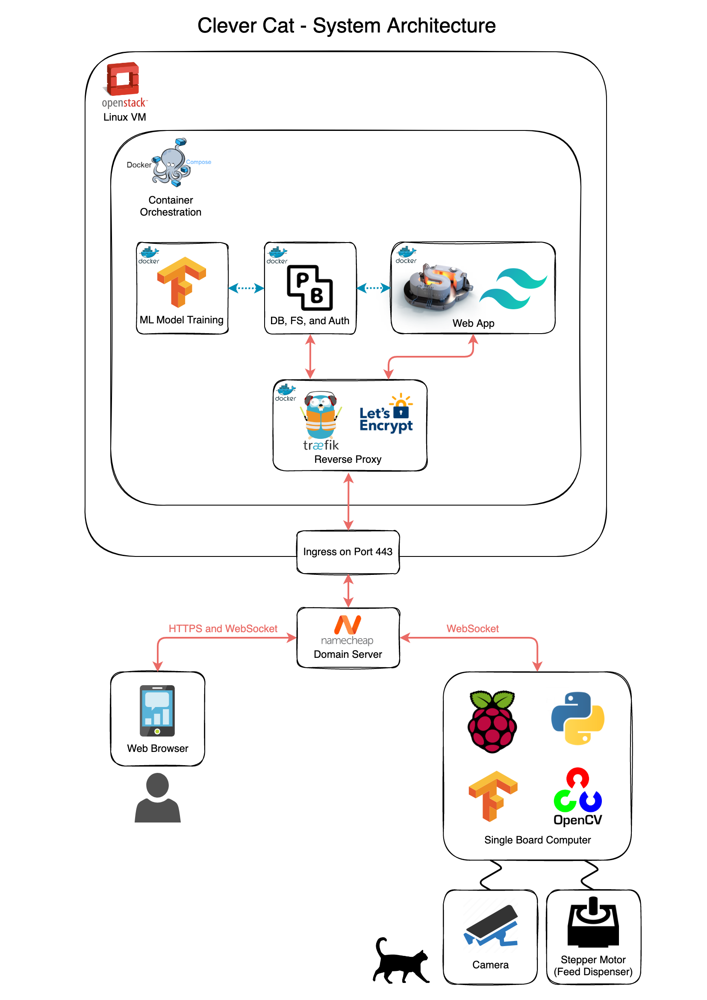

# Clever Cat 😸

A prototypical IoT device that uses machine learning models to detect cats and a servo motor-powered dispenser to dispense feed for them based on feed schedules defined by the cats' owner using a web app.

When fed, the device uploads photos of the cat and feed details to a realtime database, which is subscribed to by the web app used by the owner giving them instant updates on feeds as well as pics of their cat. The owner could then tag these images with their cat's name, and when enough tagged photos are gathered an event would trigger a new machine learning model to be trained that differentiates between all the user's cats, allowing for an individual feed schedule to be assigned to each. The user can also remotely configure the feed schedules for each cat using the web app by publishing the schedule to a table in the realtime DB subscribed to by the device.

Here's a link to [a video demonstration of Clever Cat](https://youtu.be/kG52tjd7Qfw).

## Technologies Used



### Device

The following parts were used to make the feeder device:

- Raspberry Pi 3 model B
- High Torque MG996R Servo Motor
- Pi camera module
- Breadboard, jumper cables and some buttons (for testing construction)

The device runs a Python app that uses libraries including OpenCV, Tensorflow, Pocketbase, and GPIO Zero.


### VM

The VM runs containerised microservices running on Docker Compose.

- The backend, including DB, file server, auth, and realtime websocket connections is managed with Pocketbase.
- The web app is created with SvelteKit, Tailwind CSS and Daisy UI, and runs on Node.JS.
- The model training service is a Python/FastAPI app running Tensorflow.
- The reverse proxy service uses Traefik as Let's Encrypt for SSL cert management

## Device Requirements

The device runs Raspbian Lite OS and Python 3.9 was used in a virtual environment.

In order to use OpenCV in the virtual environment, first run the following to install OpenCV and all the required system dependencies.

```bash
sudo apt update && sudo apt upgrade
sudo apt install python3-opencv
```

```opencv-python``` or ```opencv-python-headless``` can then be installed in the virtual environment using pip – use the requirements.txt file provided to install all required dependencies as well as OpenCV.

In order to make the servo motor stable and avoid jitter, ```pigpio``` also needs to be installed:

```bash
sudo apt-get update && sudo apt-get upgrade
sudo apt-get install pigpio
sudo apt-get install python3-pigpio
```

An environment variable then needs to be set for gpiozero to use pigpio.

```bash
export GPIOZERO_PIN_FACTORY=pigpio
```

Finally, legacy camera mode must be enabled for OpenCV to use the Pi Camera Module 2 as a standard capture device. Enter ```sudo raspi-config```, then navigate to "Interface Options", and select "Legacy Camera Enable".

## VM Requirements

The only requirements for the VM are Docker and Docker Compose.I used a Ubuntu 22.04.1 VM, but any Linux VM capable of running Docker and Docker Compose should work. See [here](https://docs.docker.com/engine/install/) for options to install Docker and Docker Compose on other operating systems.

```
sudo apt-get update && sudo apt-get upgrade
sudo apt-get install docker-ce docker-ce-cli containerd.io docker-compose-plugin
```

Then follow the steps to [manage Docker as a non-root user](https://docs.docker.com/engine/install/linux-postinstall/).

## VM Installation

TODO: I should simplify some of this adding a .env file to docker-compose.yaml containing exposed URLs, email addresses, etc. and also a shell script to create acme.json.

To set up SSL certs with Traefik and Let's Encrypt, create "acme.json" in ./reverse-proxy directory and apply ```chmod 600``` to it. Edit the reverse proxy to use your own URLs and email address.

You'll also need to change Pocketbase's exposed URL in the web app. I think this is currently only used in the /my/dashboard/photos/page/[pageNumber]/+page.svelte file.

You should then be able to run the following to build and run all services.

```bash
docker compose up
```

After everything is running. Set up an admin account on Pocketbase (your-pocketbase-url/_/), and import the pb_schema.json file under Settings/Import Collections. Then create a default user (whose ID will be used on the device), and a default pet, called 'cat' belonging to this user. Finally, create a model associated with the default user and default pet that uses the .tflite file in device/models directory. You can then optionally set up SMTP settings for email verification and forgot passwords.

## Device Installation

Set up environment varibles in env.example file.

Create and activate virtual environment in main.py's directory, and install all dependencies:

```bash
python3 -m venv env
source env/bin/activate
pip install -r requirements.txt
```

Add the following to ```/etc/rc.local``` if you want to run the Python script on startup. Note that root privileges are required to edit this file – use ```sudo nano /etc/rc.local```.

```bash
export GPIOZERO_PIN_FACTORY=pigpio

cd /path/to/python/script/dir
source path/to/env/bin/activate
python main.py &

exit 0
```

## Notes and Acknowledgements

Thanks to [huntabyte](https://github.com/huntabyte) for the excellent SvelteKit tutorials that got me started with the web app.

Note that the commited Pocketbase directory used on the device comes from [an rc branch on the Pocketbase Python SDK repo](https://github.com/vaphes/pocketbase/tree/0.8.0-rc2), and will be replaced with a pip dependency when a package is released for the latest PB version.
